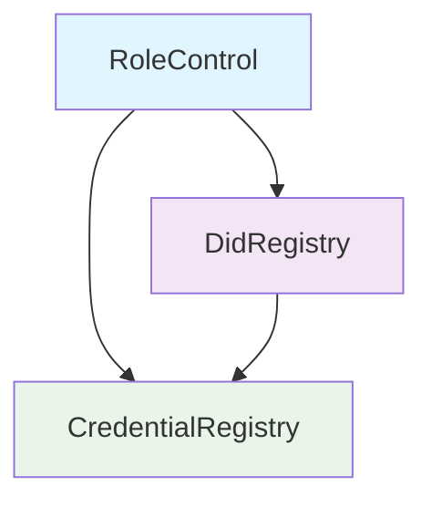

# Smart Contracts Directory

## 📋 Overview

This directory contains a **Self-Sovereign Identity (SSI)** blockchain system implementing the **W3C DID Core v1.0** and **Verifiable Credentials (VC) Data Model v2.0** specifications. The system creates a decentralized trust triangle between **Trustees**, **Issuers**, and **Holders** for managing digital identities and verifiable credentials on private Ethereum network.

## 🏗️ High-Level Architecture

### SSI Trust Triangle Model

```
    ┌─────────────┐
    │   TRUSTEE   │ ←─── System Administrator
    │ (Governance)│      • Assigns roles
    └──────┬──────┘      • Manages permissions
           │             • Oversees system integrity
           │
           ▼
    ┌─────────────┐      ┌─────────────┐
    │   ISSUER    │ ────▶│   HOLDER    │
    │(Credentials)│      │ (Identity)  │
    └─────────────┘      └─────────────┘
```

### System Components

The smart contract system consists of three interconnected layers:

1. **🔐 Authentication Layer** (`auth/`) - Role-based access control
2. **🆔 Identity Layer** (`did/`) - Decentralized identifier management  
3. **📜 Credential Layer** (`vc/`) - Verifiable credentials registry

## 📁 Directory Structure

```
smart-contracts/
├── contracts/
│   ├── auth/                       # Authentication & Role Management
│   │   ├── AuthErrors.sol          # Custom error definitions
│   │   ├── IRoleControl.sol        # Role control interface
│   │   └── RoleControl.sol         # Role management implementation
│   │
│   ├── did/                        # DID Registry (W3C DID Core)
│   │   ├── DidErrors.sol           # DID-specific error definitions
│   │   ├── DidTypeNew.sol          # DID data structures
│   │   ├── IDidRegistry.sol        # DID registry interface
│   │   └── DidRegistry.sol         # DID registry implementation
│   │
│   └── vc/                         # Verifiable Credentials (W3C VC v1.1)
│       ├── CredentialErrors.sol    # VC-specific error definitions
│       ├── CredentialType.sol      # VC data structures
│       ├── ICredentialRegistry.sol # VC registry interface
│       └── CredentialRegistry.sol  # VC registry implementation
│
├── scripts/                        # Deployment & Management Scripts
│   ├── deploy.js                   # Complete SSI system deployment
│   ├── assign-issuer-role.js       # Assign issuer privileges
│   ├── assign-holder-role.js       # Assign holder privileges
│   ├── create-dids.js              # Create DIDs via Web3Signer
│   └── issue-creds.js              # Issue VCs via Web3Signer
│
├── hardhat.config.js               # Hardhat configuration
├── package.json                    # Dependencies & project metadata
└── .gitignore                      # Git ignore rules
```

## 🔧 Core Smart Contracts

### 1. RoleControl (`auth/RoleControl.sol`)

**Purpose**: Implements the SSI trust triangle with role-based access control.

**Key Features**:
- **TRUSTEE**: System governance and administration
- **ISSUER**: Entity that creates and issues verifiable credentials
- **HOLDER**: Entity that receives and manages credentials
- Hierarchical role management with permission inheritance

**Gas Optimization**: Uses packed structs and efficient storage patterns.

### 2. DidRegistry (`did/DidRegistry.sol`)

**Purpose**: W3C DID Core compliant registry for decentralized identifiers.

**Key Features**:
- Create, update, and deactivate DIDs
- Document hash integrity verification (keccak256)
- Meta-transaction support for gasless operations
- DID lifecycle management with status tracking

**Standards Compliance**: Fully implements W3C DID Core specification.

### 3. CredentialRegistry (`vc/CredentialRegistry.sol`)

**Purpose**: W3C VC Data Model v1.1 compliant registry for verifiable credentials.

**Key Features**:
- Issue verifiable credentials with IPFS integration
- Credential status management (ACTIVE, SUSPENDED, REVOKED)
- Cryptographic integrity via JSON canonicalization (JCS)
- Event-driven architecture for credential lifecycle tracking

**Storage Optimization**: Uses IPFS for credential data storage, on-chain for metadata only.

## 🔗 Contract Dependencies



**Deployment Order**:
1. `RoleControl` (Independent)
2. `DidRegistry` (Requires RoleControl)
3. `CredentialRegistry` (Requires both RoleControl and DidRegistry)

## ⚡ Gas Optimization Strategies

### Storage Packing
- **DidMetadata**: Packed into 2 storage slots (32 + 24 bytes)
- **CredentialMetadata**: Optimized with uint64 timestamps
- **Role Mappings**: Single storage slot per role assignment

### Function Optimization
- **Modifiers**: Efficient validation with early returns
- **Events**: Minimal data emission for indexing
- **Batch Operations**: Support for multiple operations in single transaction

## 🛠️ Development Setup

### Prerequisites
```bash
node >= 16.0.0
npm >= 8.0.0
```

### Installation
```bash
# Install dependencies
npm install

# Or using pnpm (recommended)
pnpm install
```

### Local Development
```bash
# Start local Hardhat node
npx hardhat node

# Deploy contracts to local network
npx hardhat run scripts/deploy.js --network localhost

# Run tests
npx hardhat test
```

## 🚀 Deployment Guide

### 1. Complete System Deployment
```bash
npx hardhat run scripts/deploy.js --network localhost
```

This script deploys all contracts in the correct order and saves deployment addresses to `deployment-info.json`.

### 2. Role Assignment
```bash
# Assign ISSUER role
npx hardhat run scripts/assign-issuer-role.js --network localhost

# Assign HOLDER role  
npx hardhat run scripts/assign-holder-role.js --network localhost
```

### 3. DID Creation
```bash
# Create DIDs for issuer and holder
npx hardhat run scripts/web3signer-create-dids.js --network localhost
```

### 4. Credential Issuance
```bash
# Issue verifiable credentials
npx hardhat run scripts/web3signer-issue-creds.js --network localhost
```

## 📊 System Workflow

### DID Lifecycle
```
Create DID → Document Hash → On-Chain Storage → Resolve/Update → Deactivate
     ↓              ↓              ↓                  ↓              ↓
   Address    Canonicalized     Metadata        Version Control   Terminal
  Validation     JSON-LD        Timestamp           Updates        State
```

### Credential Lifecycle
```
Generate VC → Canonicalize → Hash → IPFS Upload → On-Chain Registry → Status Management
     ↓             ↓          ↓         ↓              ↓                  ↓
   W3C VC     Deterministic   ID    Content CID    Metadata Only    ACTIVE/SUSPENDED/REVOKED
  Structure      JSON                                Storage
```

## 🔍 Security Features

### Access Control
- **Role-based permissions** with hierarchical validation
- **Owner verification** for identity operations
- **Signature validation** for meta-transactions

### Data Integrity
- **keccak256 hashing** for document integrity
- **JSON canonicalization** for consistent hashing
- **IPFS content addressing** for tamper-proof storage

## 🎯 Learning Framework

### Beginner Concepts
- **Smart Contract Basics**: State management, events, modifiers
- **Access Control**: Role-based permissions and inheritance
- **Error Handling**: Custom errors for gas efficiency

### Intermediate Concepts
- **Storage Optimization**: Struct packing and slot management
- **Event Architecture**: Indexed parameters and off-chain queries
- **Interface Design**: Separation of concerns and modularity

### Advanced Concepts
- **Meta-transactions**: Gasless operations with signature verification
- **Cryptographic Hashing**: Document integrity and content addressing
- **Standards Compliance**: W3C DID and VC implementation patterns

## 📈 Performance Metrics

| Operation | Gas Cost | Storage Slots | Optimization Level |
|-----------|----------|---------------|-------------------|
| Role Assignment | ~75,000 | 1 | High |
| DID Creation | ~140,000 | 2 | High |
| Credential Issue | ~120,000 | 3 | Medium |

## 🔮 Future Enhancements

### Planned Features
- **Versioning & Key Rotation Management**: 
- **Revocation Registry Management**: Modular, scalable, and privacy-preserving revocation system
- **Verifiable Presentation Registry**: Selective Disclosure, Holder possess one or more valid VCs
- **Cross-chain Compatibility**: Multi-network DID resolution (Interoperable System)
- **Delegation Patterns**: Proxy-based contract upgradability with controlled authorization (EIP-1967 + UUPS/EIP-1822)

### Optimization Opportunities
- **EIP-1167 Minimal Proxies**: For credential templates
- **Diamond Pattern/Multi-Facet Proxy**: For modular contract upgrades (EIP-2535)
- **Layer 2 Integration**: For reduced gas costs

### Possible Options
- **Conventional Databases Integration**: Aside from IPFS, utilizing Encrypted Off-Chain Storage to store whole DID/VC, such as cloud DB, NoSQL, SQLite, etc.
- **Adding other Execution Clients or DID Frameworks**: Nethermind, Erigon, Reth, Indy-Besu, Indy-Plenum
- **Zero-Knowledge Proof Verification**: Mathematical proof for verifiable credential verification
- **Other Consensus Algorithms Implementation**: QBFT, IBFT 2.0, Raft
- **Consensus Client Integration**: Running private PoS (testnet) mimic the Ethereum mainnet's merge for testing the real-world traffic

## 📚 W3C Standards Compliance

### DID Core Specification
- ✅ DID Document structure and resolution
- ✅ DID Methods and identifier format
- ✅ Verification methods and authentication
- ✅ Service endpoints and metadata

### VC Data Model v2.0
- ✅ Credential structure and context
- ✅ Issuer and subject identification  
- ✅ Proof mechanisms and verification
- ✅ Status and lifecycle management

### Git Workflow
```bash
# Feature development
git checkout -b feature/new-functionality
git commit -m "feat: add new functionality"
git push origin feature/new-functionality
```

---

**Learning Resources**:
- [W3C DID Core Specification](https://www.w3.org/TR/did-core/)
- [W3C VC Data Model](https://www.w3.org/TR/vc-data-model/)
- [Ethereum Development Documentation](https://ethereum.org/developers/)
- [Hardhat Framework Guide](https://hardhat.org/getting-started/)
- [Ethers.js v6 Library Docs](https://docs.ethers.org/v6/)